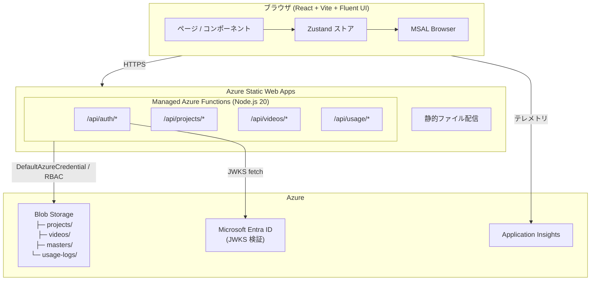
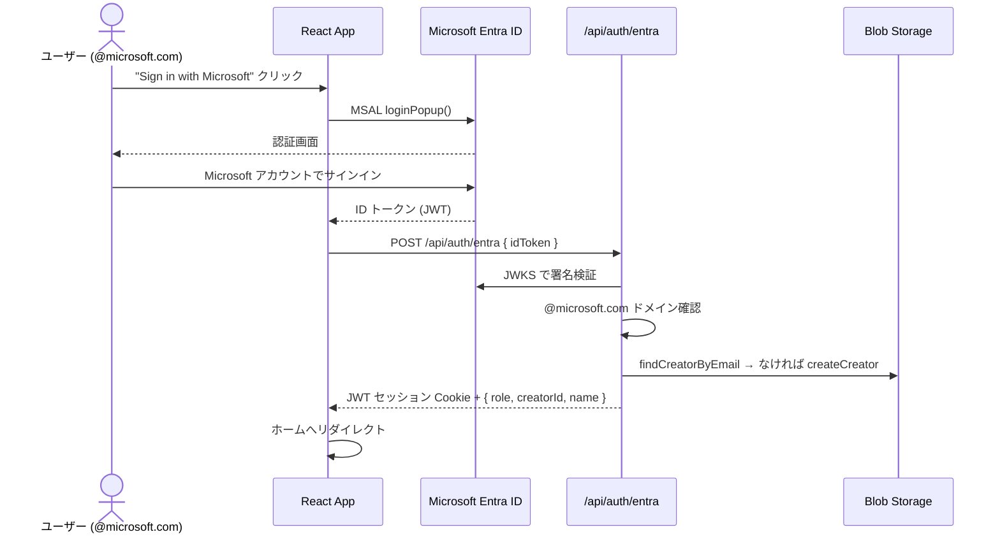

# Click Through Demo Builder

動画上にクリックポイントを配置して、操作手順を体験できる**インタラクティブデモ**を作成・共有できる Web アプリケーションです。

> **Access**: `@microsoft.com` アカウントで Microsoft Entra ID SSO ログインが可能です。

---

## 目次

1. [何ができるか](#何ができるか)
2. [設計思想](#設計思想)
3. [アーキテクチャ](#アーキテクチャ)
4. [認証フロー](#認証フロー)
5. [セキュリティ](#セキュリティ)
6. [API リファレンス](#api-リファレンス)
7. [ローカル開発の始め方](#ローカル開発の始め方)
8. [Azure 初期セットアップ](#azure-初期セットアップ)
9. [環境変数リファレンス](#環境変数リファレンス)
10. [デプロイ](#デプロイ)
11. [改善リクエスト・バグ報告](#改善リクエストバグ報告)

---

## 何ができるか

| 機能 | 説明 |
|---|---|
| **デモ作成** | 動画をアップロードし、任意のタイムスタンプ・位置にクリックポイントを配置 |
| **デモ再生** | クリックポイントが点滅し、視聴者が順にクリックして操作手順を体験 |
| **プロジェクト管理** | デモの保存・複製・削除・グループ割り当て・JSON エクスポート |
| **グループ管理** | デモをグループに分類してフィルタリング |
| **利用ログ収集** | デモ利用者の IP・拠点・グループ情報をログ収集 |
| **SSO 自動登録** | `@microsoft.com` アカウントで初回ログイン時にクリエイターを自動作成 |

---

## 設計思想

### シンプルさを優先する

- **動画 + クリックポイント** のみ。複雑なアニメーション設定は持たない
- 作成者は技術者でなくてもよい — ドラッグ&ドロップとクリックで完成する
- 視聴者はダウンロード・インストール不要。URL を開くだけで体験できる

### Azure ネイティブ構成

- サーバーレス構成（Azure Static Web Apps + Managed Functions）でインフラ管理ゼロ
- パスワードなどのシークレットは環境変数で管理（コードにハードコードしない）
- 認証は Microsoft Entra ID に委譲（パスワード管理・MFA を自前実装しない）

### 型安全 & テスト可能

- TypeScript strict mode をフロント・バックエンド全体で適用
- Zustand でステート管理を集約し、デバッグ・テストを容易にする

---

## アーキテクチャ



### 技術スタック

| レイヤー | 技術 | 選定理由 |
|---|---|---|
| フロントエンド | React 18 + TypeScript + Vite | 型安全 SPA、高速 HMR |
| UI | Fluent UI React v9 | Microsoft デザインシステムで一貫性確保 |
| 状態管理 | Zustand | 再レンダリング制御が容易、デザイナーの複雑な状態に適合 |
| アニメーション | Framer Motion | パルスアニメーション・レイアウトアニメーション |
| バックエンド | Azure Functions v4 (Node.js 20) | サーバーレス、SWA に同梱 |
| ストレージ | Azure Blob Storage + DefaultAzureCredential | パスワードレス RBAC 認証 |
| 認証 | Microsoft Entra ID (MSAL popup) + JWT Cookie | シームレス SSO、@microsoft.com 限定 |

### Blob Storage 構造

```
Storage Account
├── projects/
│   └── {projectId}.json           ← プロジェクト設定データ
├── videos/
│   └── {projectId}/video.{ext}    ← 動画ファイル
├── masters/
│   └── groups.json                ← グループマスター一元管理
└── usage-logs/
    └── {yyyy-mm-dd}/{ts}-{uuid}.json   ← 利用ログ（日付パーティション）
```

---

## 認証フロー



> **注意**: `@microsoft.com` 以外のアカウントは `403 Forbidden` を返します。対象ドメインを変更する場合は `api/src/functions/auth-entra.ts` の `ALLOWED_DOMAIN` を修正してください。

---

## セキュリティ

本アプリケーションでは以下のセキュリティ対策を実装しています。

### 認証・認可

| 対策 | 説明 |
|---|---|
| **Entra ID SSO** | Microsoft Entra ID の JWKS 署名検証による ID トークン認証 |
| **ドメイン制限** | `@microsoft.com` アカウントのみアクセス可能 |
| **JWT Cookie** | `HttpOnly`, `Secure`, `SameSite=Strict` 属性によるセッション管理 |
| **IDOR 防止** | プロジェクト更新・削除・複製・動画アップロード時にオーナー検証（`creatorId` 照合） |
| **サーバーサイド creatorId** | プロジェクト作成・更新時に `creatorId` をサーバー側で JWT から取得（クライアント入力を無視） |

### 入力バリデーション

| 対策 | 説明 |
|---|---|
| **UUID 形式検証** | `projectId`, `creatorId` に UUID v4 形式バリデーションを適用 |
| **文字列長制限** | タイトル（100 文字）、説明（500 文字）、コメント（2,000 文字）、申請理由（500 文字） |
| **クリックポイント数制限** | プロジェクトあたり最大 50 個 |
| **動画 MIME タイプ制限** | `video/mp4`, `video/webm` のみ許可 |
| **動画サイズ制限** | バイナリアップロード時に最大 500 MB |

### インジェクション防止

| 対策 | 説明 |
|---|---|
| **HTML エスケープ** | メール送信時にユーザー入力値（名前・メールアドレス・申請理由）を `escapeHtml()` でサニタイズ |
| **XSS 防止** | HTML レスポンス内のクリエイター名をエスケープ |
| **SSRF 防止** | IP アドレスの形式バリデーション（IPv4/IPv6）を外部 API 呼び出し前に実施 |
| **User-Agent 制限** | ログ記録時に User-Agent を 500 文字に切り詰め |

### エラー処理

| 対策 | 説明 |
|---|---|
| **情報漏洩防止** | エラーレスポンスでは内部エラー詳細を返さず、一般的なメッセージを返却 |
| **適切な HTTP ステータス** | 認証エラー (401)、権限エラー (403)、未検出 (404)、バリデーションエラー (400) を使い分け |

---

## API リファレンス

すべてのエンドポイントは `/api` プレフィックス配下で提供されます。`🔒` は認証必須を示します。

### 認証

| メソッド | パス | 説明 |
|---|---|---|
| POST | `/api/auth/entra` | Entra ID トークン検証・JWT Cookie 発行 |
| GET | `/api/auth/me` | 🔒 現在のログインユーザー情報 |
| POST | `/api/auth/logout` | ログアウト（Cookie 削除） |
| POST | `/api/auth/apply-designer` | 🔒 デザイナー権限申請 |

### プロジェクト

| メソッド | パス | 説明 |
|---|---|---|
| GET | `/api/projects` | 🔒 自分のプロジェクト一覧 |
| POST | `/api/projects` | 🔒 プロジェクト新規作成 |
| GET | `/api/projects/{id}` | プロジェクト詳細取得 |
| PUT | `/api/projects/{id}` | 🔒 プロジェクト更新（オーナーのみ） |
| DELETE | `/api/projects/{id}` | 🔒 プロジェクト削除（オーナーのみ） |
| POST | `/api/projects/{id}/duplicate` | 🔒 プロジェクト複製（オーナーのみ） |

### 動画

| メソッド | パス | 説明 |
|---|---|---|
| POST | `/api/videos/upload` | 🔒 動画アップロード（SAS URL 発行 / バイナリ） |
| GET | `/api/videos/{projectId}` | 動画 SAS URL 取得 |
| DELETE | `/api/videos/{projectId}` | 🔒 動画削除 |

### クリエイター

| メソッド | パス | 説明 |
|---|---|---|
| GET | `/api/creators` | 🔒 クリエイター一覧（管理者のみ） |
| POST | `/api/creators` | 🔒 クリエイター作成（管理者のみ） |
| GET | `/api/creators/{id}` | クリエイター情報取得 |
| PUT | `/api/creators/{id}` | 🔒 クリエイター更新（管理者のみ） |
| DELETE | `/api/creators/{id}` | 🔒 クリエイター削除（管理者のみ） |
| POST/GET | `/api/creators/{id}/verify` | デザイナー承認 |

### ソーシャル

| メソッド | パス | 説明 |
|---|---|---|
| GET | `/api/demos` | 公開デモ一覧 |
| POST | `/api/demos/{id}/like` | 🔒 いいね |
| GET/POST/DELETE | `/api/demos/{id}/comments` | 🔒 コメント管理 |
| GET | `/api/demos/{id}/stats` | デモ統計 |
| GET | `/api/feed` | 新着フィード |
| GET | `/api/home/rankings` | ホームランキング |
| GET | `/api/my/likes` | 🔒 自分のいいね一覧 |

### お気に入り・グループ

| メソッド | パス | 説明 |
|---|---|---|
| GET/POST/DELETE | `/api/favorites` | 🔒 お気に入り管理 |
| GET | `/api/groups` | グループ一覧 |
| POST | `/api/groups` | 🔒 グループ作成（管理者のみ） |
| PUT | `/api/groups/{id}` | 🔒 グループ更新（管理者のみ） |
| DELETE | `/api/groups/{id}` | 🔒 グループ削除（管理者のみ） |

### 利用ログ

| メソッド | パス | 説明 |
|---|---|---|
| POST | `/api/usage/demo-log` | デモ利用ログ記録 |

---

## ローカル開発の始め方

### 前提条件

- **Node.js 20** 以上
- **Azure Functions Core Tools v4**（`npm install -g azure-functions-core-tools@4`）
- **Azure CLI**（`az login` 済み）— Azure Blob Storage を使う場合
- または **Azurite**（`npx azurite`）— ローカルエミュレーターを使う場合

### 1. クローンと依存関係インストール

```bash
git clone https://github.com/geekfujiwara/ClickThroughDemoBuilder.git
cd ClickThroughDemoBuilder

npm ci          # フロントエンド依存関係
cd api && npm ci && cd ..   # API 依存関係
```

### 2. API 設定ファイルの作成

```bash
cd api
cp local.settings.sample.json local.settings.json
# local.settings.json を編集（下記の変数リファレンスを参照）
```

最低限必要な設定：

```json
{
  "Values": {
    "JWT_SECRET": "<32文字以上のランダム文字列>",
    "ENTRA_CLIENT_ID": "<App Registration のクライアント ID>",
    "APP_URL": "http://localhost:4280"
  }
}
```

### 3. フロントエンド環境変数の設定

プロジェクトルートに `.env.local` を作成：

```
VITE_ENTRA_CLIENT_ID=<App Registration のクライアント ID>
```

### 4. 開発サーバーの起動

```bash
# ターミナル 1: API ビルド（ウォッチモード）
cd api && npm run watch

# ターミナル 2: Functions ホスト
cd api && npm start

# ターミナル 3: フロントエンド
npm run dev
```

SWA CLI を使うと API とフロントエンドを統合して動作確認できます：

```bash
swa start http://localhost:5173 --api-location http://localhost:7071
# → http://localhost:4280 でアクセス
```

---

## Azure 初期セットアップ

### 1. Azure App Registration（Entra ID）

1. [Azure Portal](https://portal.azure.com) → **Microsoft Entra ID** → **アプリの登録** → **新規登録**
2. サポートされているアカウントの種類: **任意の組織のディレクトリ内のアカウント（マルチテナント）**
3. リダイレクト URI: **シングルページアプリケーション (SPA)** → デプロイ先 URL を追加
4. **概要**画面の **アプリケーション (クライアント) ID** を控える

### 2. Azure Static Web Apps の作成

```bash
az staticwebapp create \
  --name swa-clickthrough-prod \
  --resource-group rg-clickthrough-prod \
  --location eastasia \
  --sku Free
```

### 3. Azure Blob Storage の作成と RBAC 設定

```bash
# ストレージアカウント作成
az storage account create \
  --name st<appname>prod \
  --resource-group rg-clickthrough-prod \
  --sku Standard_LRS --kind StorageV2

# コンテナ作成
AZURE_STORAGE_ACCOUNT_URL=https://st<appname>prod.blob.core.windows.net \
node api/create-containers.mjs

# SWA マネージド ID に Blob Data Contributor を付与
SWA_ID=$(az staticwebapp show -n swa-clickthrough-prod -g rg-clickthrough-prod --query "identity.principalId" -o tsv)
STORAGE_ID=$(az storage account show -n st<appname>prod -g rg-clickthrough-prod --query id -o tsv)
az role assignment create --role "Storage Blob Data Contributor" \
  --assignee-object-id $SWA_ID --scope $STORAGE_ID
```

### 4. App Settings の設定

Azure Portal → 静的 Web アプリ → **構成** → **アプリケーション設定**：

| 変数名 | 値 |
|---|---|
| `STORAGE_ACCOUNT_NAME` | `st<appname>prod` |
| `JWT_SECRET` | ランダムな 32 文字以上の文字列 |
| `ENTRA_CLIENT_ID` | App Registration のクライアント ID |
| `APP_URL` | `https://<your-swa>.azurestaticapps.net` |
| `APPLICATIONINSIGHTS_CONNECTION_STRING` | （任意）Application Insights 接続文字列 |

### 5. GitHub Secrets の設定

リポジトリ → **Settings → Secrets and variables → Actions**：

| Secret 名 | 値 |
|---|---|
| `AZURE_STATIC_WEB_APPS_API_TOKEN` | SWA のデプロイトークン |
| `VITE_ENTRA_CLIENT_ID` | App Registration のクライアント ID |
| `APPINSIGHTS_CONNECTION_STRING` | （任意）Application Insights 接続文字列 |

---

## 環境変数リファレンス

### API（Azure Functions）

| 変数名 | 必須 | 説明 |
|---|---|---|
| `STORAGE_ACCOUNT_NAME` | ✅ | Blob Storage アカウント名 |
| `JWT_SECRET` | ✅ | JWT Cookie 署名キー（32 文字以上）|
| `ENTRA_CLIENT_ID` | ✅ | App Registration クライアント ID |
| `APP_URL` | ✅ | アプリの公開 URL |
| `STORAGE_CONNECTION_STRING` | ⬜ | ローカル開発用（Azurite: `UseDevelopmentStorage=true`）|
| `GRAPH_SENDER` | ⬜ | メール送信元 UPN |
| `AZURE_TENANT_ID` | ⬜ | Graph API メール送信用テナント ID |
| `AZURE_CLIENT_ID` | ⬜ | Graph API メール送信用クライアント ID |
| `AZURE_CLIENT_SECRET` | ⬜ | Graph API メール送信用クライアントシークレット |
| `APPLICATIONINSIGHTS_CONNECTION_STRING` | ⬜ | Application Insights |
| `IP_SITE_RULES` | ⬜ | IP → 拠点名マッピング（JSON 配列）|

### フロントエンド（Vite ビルド時）

| 変数名 | 必須 | 説明 |
|---|---|---|
| `VITE_ENTRA_CLIENT_ID` | ✅ | MSAL 初期化用クライアント ID |
| `VITE_APPINSIGHTS_CONNECTION_STRING` | ⬜ | フロントエンドテレメトリ |
| `VITE_GITHUB_URL` | ⬜ | ログインページの GitHub リンク先 |

---

## デプロイ

### 自動デプロイ（推奨）

`main` ブランチへの push で GitHub Actions が自動ビルド＆デプロイします。

```bash
git push origin main
```

ワークフロー: [.github/workflows/deploy.yml](.github/workflows/deploy.yml)

### 手動デプロイ（SWA CLI）

```bash
npm run build
cd api && npm run build && cd ..

swa deploy ./dist \
  --api-location ./api \
  --deployment-token "<SWA デプロイトークン>" \
  --env production
```

---

## 改善リクエスト・バグ報告

**Issue の登録を歓迎しています！** 🎉

機能リクエスト・バグ報告・ドキュメントの改善など、どんな内容でもお気軽にどうぞ。

👉 **[Issue を作成する](https://github.com/geekfujiwara/ClickThroughDemoBuilder/issues/new/choose)**

Issue を作成する際は、以下を記載いただけると助かります：

- **バグ**: 再現手順 / 期待する動作 / 実際の動作 / ブラウザ・OS
- **機能リクエスト**: ユースケース（どんな場面で役立つか）と期待する挙動

---

## ライセンス

MIT License — 詳細は [LICENSE](LICENSE) を参照してください。